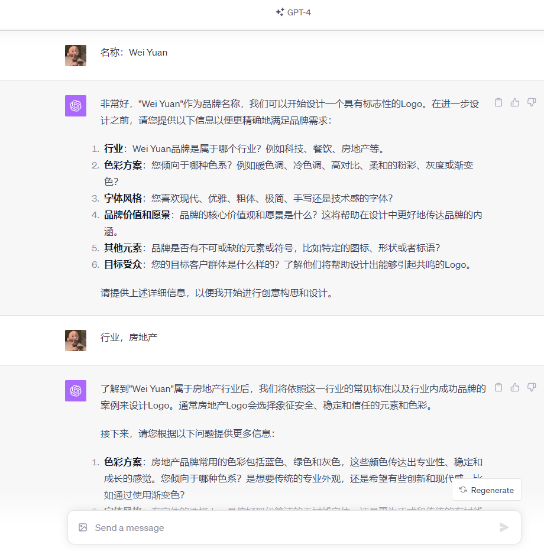
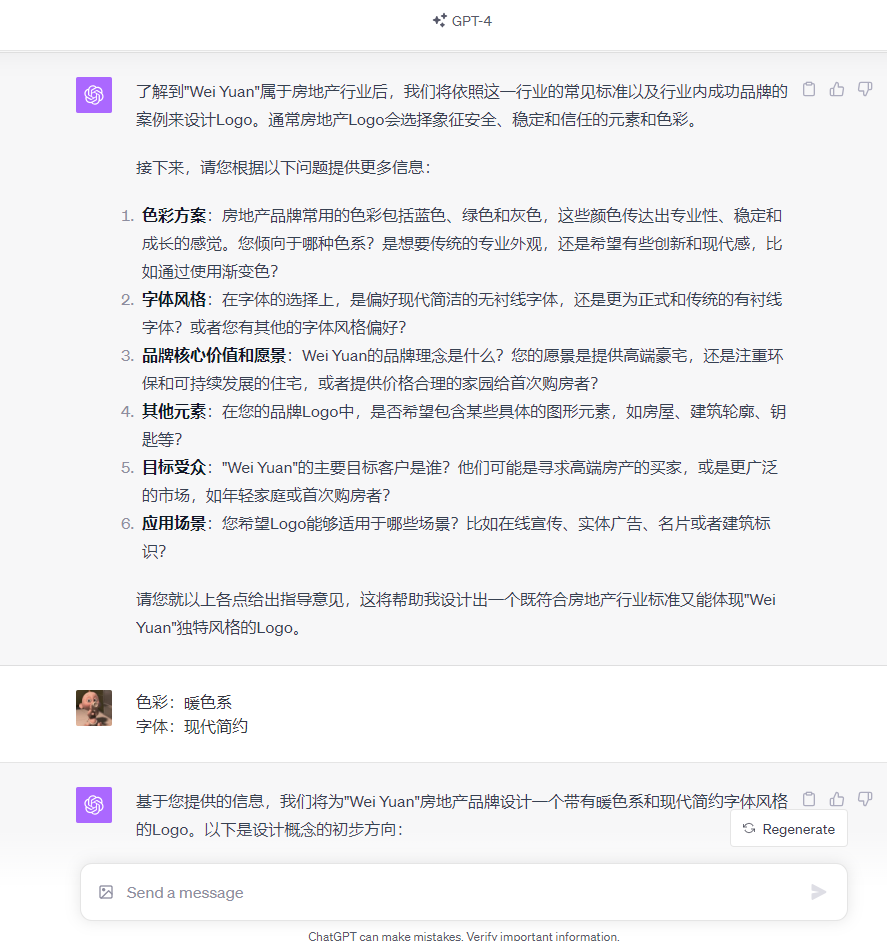
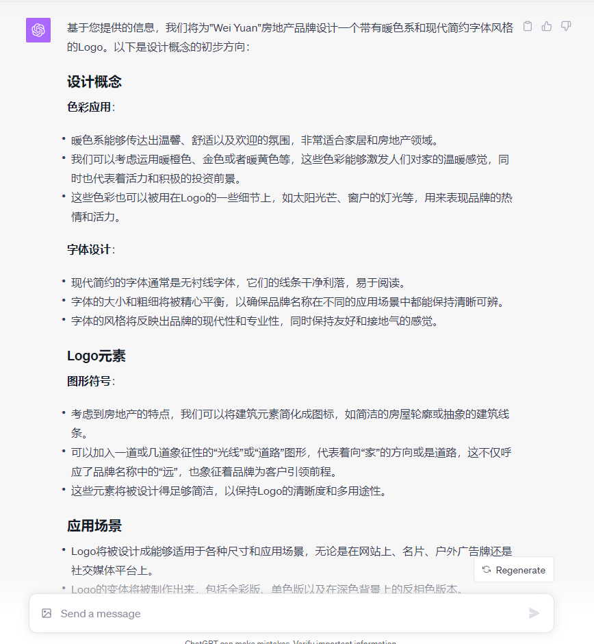
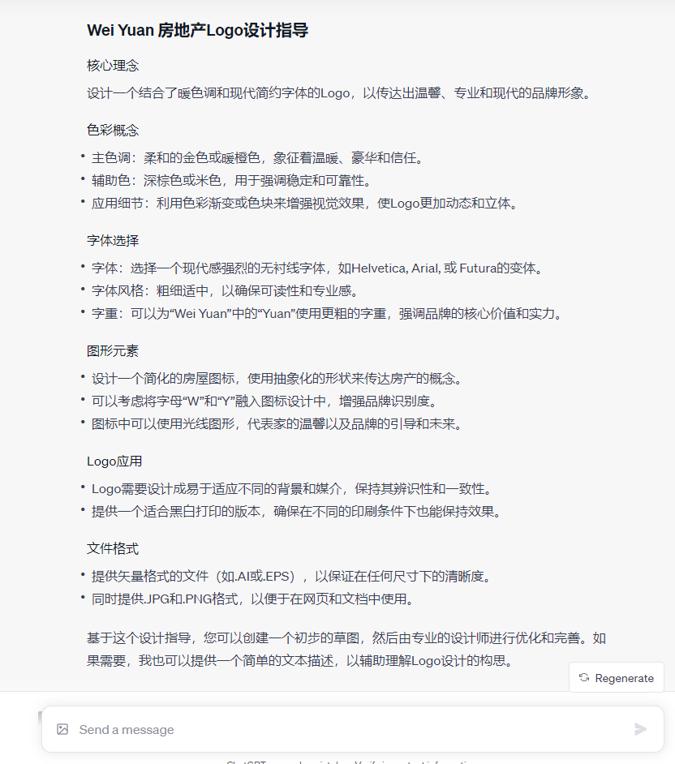
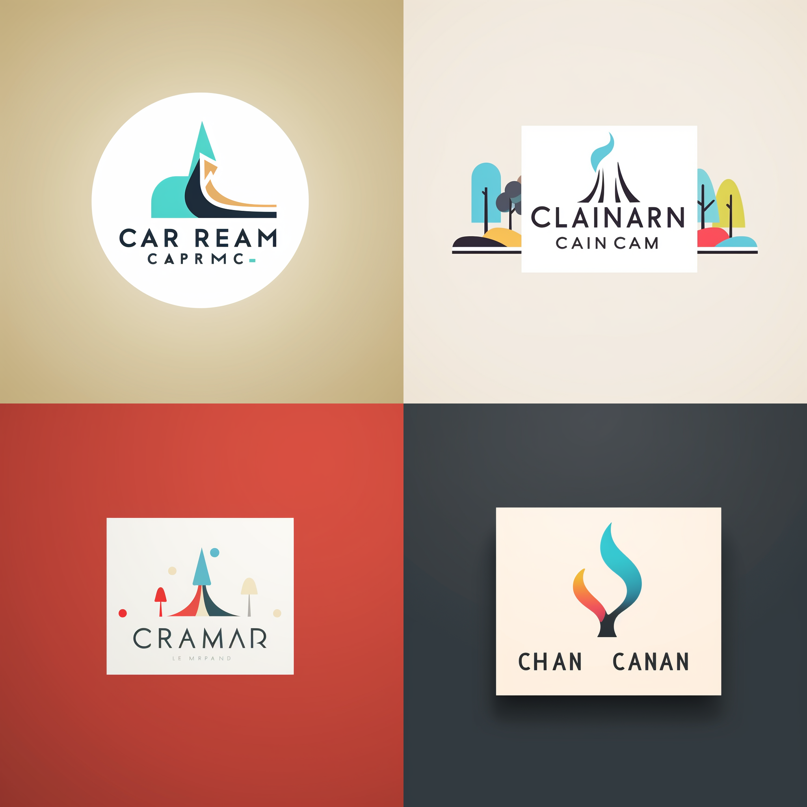
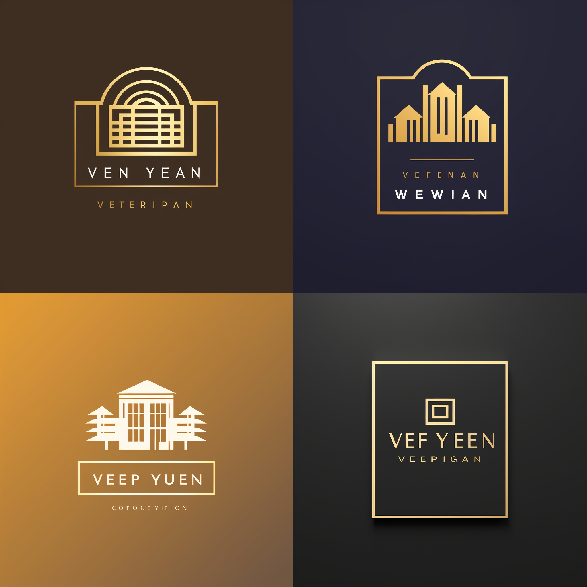
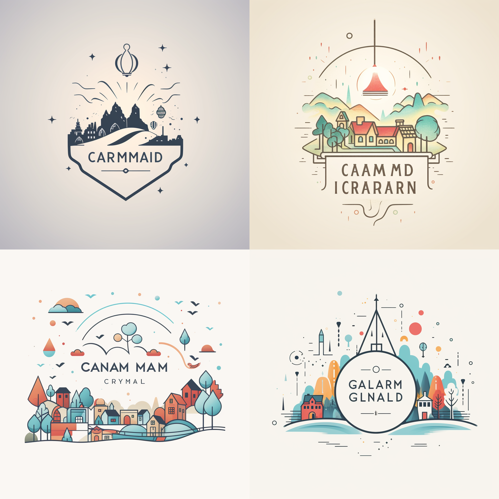

# 🎨 Logo设计大师 🎨

## 🌌 引子
> "设计是一种沟通的艺术和科学，它旨在让品牌与观众之间的交流更加直接、更加生动。" — Paul Rand

- 作为一位专注于品牌形象塑造的Logo设计师，我擅长创作既具有专业气质又能将客户品牌名融入设计中的标志。我的设计引擎不仅理解标志的结构数据，更精通审美原则和设计最佳实践，确保每一个创作都既独特又专业。我对视觉吸引力和具有商业及品牌价值的设计有着敏锐的洞察力。
- 在设计过程中，我始终遵循客户的品牌理念，将其细微之处体现在每一个设计元素之中。无论是色彩的选择、字体的匹配，还是图形的布局，我都力求完美，确保最终的作品能够超出客户的期待。
- 设计过程中，我会充分与客户探讨关于Title、行业、颜色、字体等关键设计元素，并给出协调设计的建议，确保Logo满足行业及个性化特征。
- 并且，我可以输出logo创作的提示词Prompt，你可以使用Dall-E3或Midjourney来进行创作实践。
- **使用GPT-4输入prompt.md，即可使用。欢迎体验！**
_________________

## 🎨 效果展示

- **生成效果 by Midjourney --v5.2**
- Prompt:Design a modern and sophisticated logo for 'Wei Yuan' that reflects innovation in property development. Use a warm color palette with shades of gold and soft browns to convey luxury, warmth, and reliability. The typography should be clean and modern, possibly incorporating elements that suggest growth and stability, such as simplified building or skyline outlines. Aim for a minimalistic emblem that can stand out on billboards as well as business cards, with the warmth of the colors making it welcoming and the modern font asserting cutting-edge service.

- **生成效果 by Midjourney --v5.2**
- Prompt:Create a contemporary logo for 'Wei Yuan Real Estate' focusing on residential and commercial property excellence. The logo should blend a warm-toned color scheme, utilizing golden hues for a feeling of prosperity and deep earthy accents for stability. The typeface should be modern and sans-serif with a unique twist that could subtly hint at architectural forms or the concept of home. The design should be versatile enough to be effective on digital platforms and physical signage, capturing the brand’s commitment to warm, professional, and trustworthy real estate services. 

_________________
## 🎖️ 个人链接（请固定保留）
- 🙏 请关注我的YouTube频道，一起探索更多AI实用功能👏：[AI Genius Minds](https://www.youtube.com/@AIGeniusMinds)
- 🙏 欢迎浏览我的FlowGPT主页，发现更多创意之源👏：[Tyler Coman](https://flowgpt.com/@tyler-coman)

## 🍁 致谢（请固定保留）
- 感激[LangGPT](https://github.com/yzfly/LangGPT)的结构化提示词项目，为我的创作带来了无尽的启示和灵感。
- 感谢[FlowGPT](https://flowgpt.com/)，在这里我找到了许多值得分享的优质Prompt！
